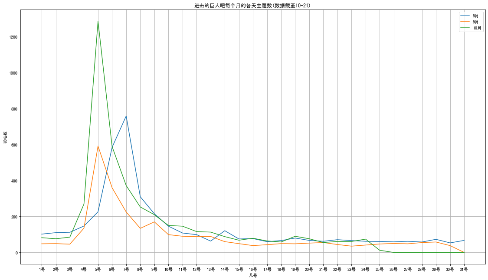
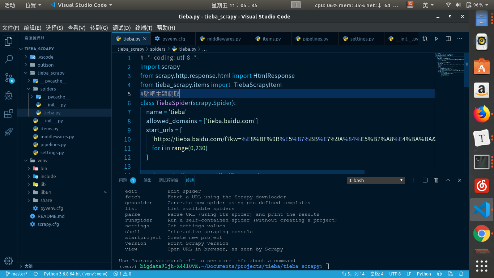

## 贴吧数据爬取即分析

- scrapy 爬虫
- pandas 数据处理
- matplotlib.pyplot数据可视化
- jieba分词



1. 终端里创建虚拟环境

   ```
    python3 -m venv venv
    source venv/bin/activate
    pip install scrapy
   ```

   

2. jupyter-notebook使用Anacodna

